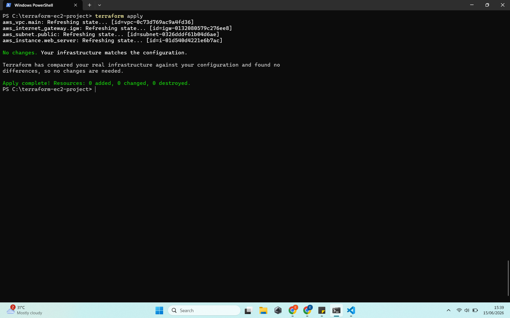
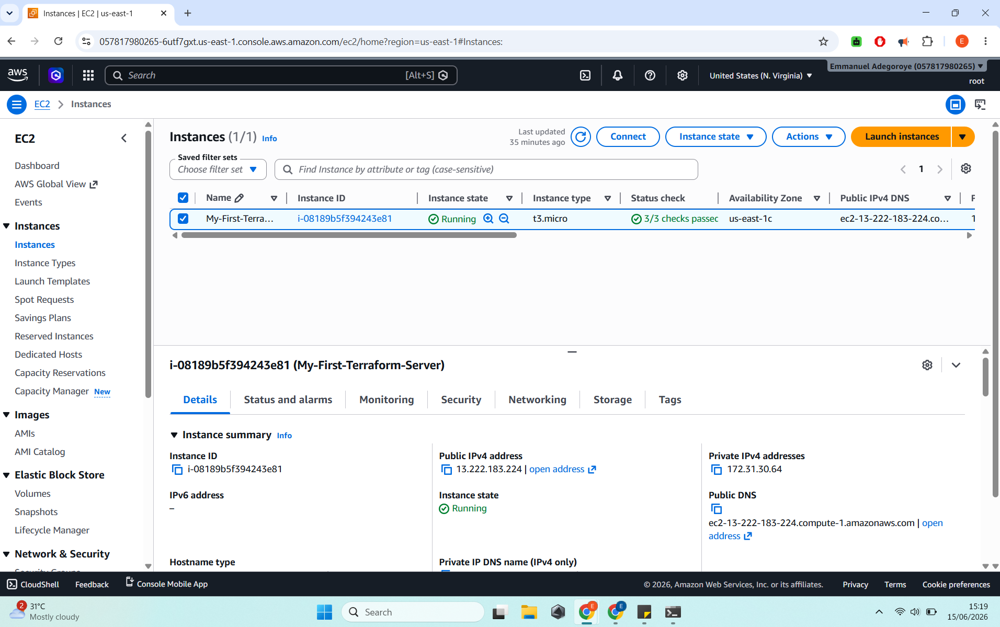
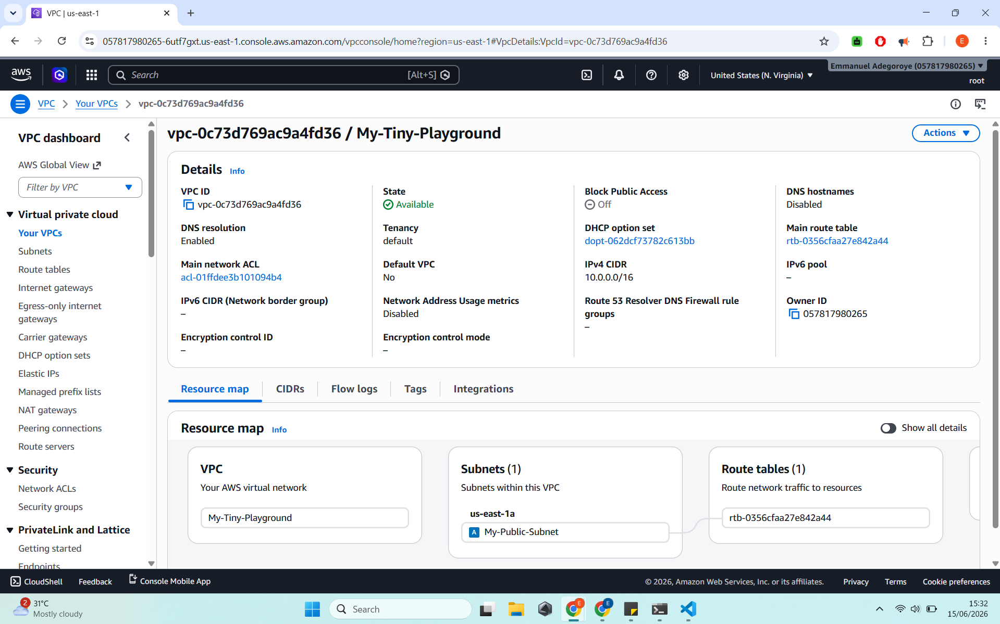
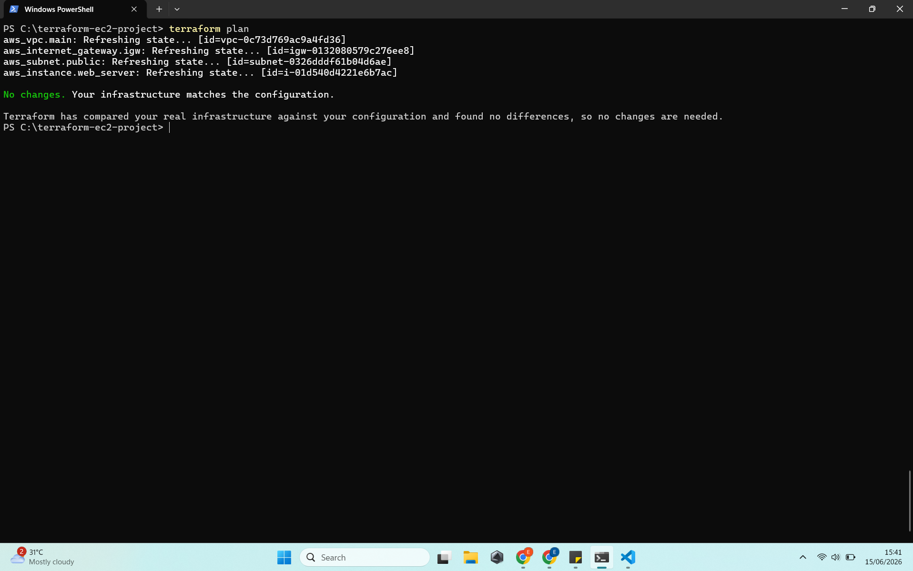
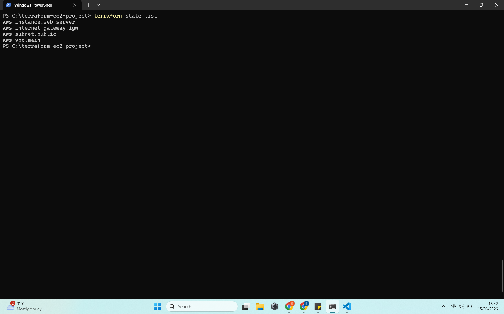

# Terraform VPC + EC2 Infrastructure as Code Project

**Automated provisioning of AWS VPC and EC2 instance using Terraform**

---

## 📋 Project Summary

This project demonstrates **Infrastructure as Code (IaC)** by using **Terraform** to automatically create a basic network (VPC) and a web server (EC2 instance) on AWS Free Tier.

**Objective**: Replace manual clicking in the AWS Console with reusable, version-controlled code.

---

## 🎯 Project Objectives & Fulfillment

| Objective                                | How It Was Achieved |
|------------------------------------------|---------------------|
| Provision basic network + web server using code | Created VPC, Subnet & EC2 using Terraform |
| Learn Infrastructure as Code             | Wrote declarative `main.tf` configuration |
| Practice full Terraform workflow         | Executed init, plan, apply, and state management |
| Understand resource dependencies         | Properly linked VPC → Subnet → EC2 |
| Maintain zero cost                       | Used only Free Tier + planned to destroy |

---

## 🛠️ Technologies Used

- Terraform (IaC)
- AWS (VPC, EC2 t3.micro)
- Git & GitHub

---

## 📸 Project Screenshots

### 1. Terraform Apply Success

### 2. EC2 Instance Running

### 3. AWS VPC Created

### 4. Terraform Plan Output

### 5. Terraform State List

---

## 🧩 What I Implemented

- Clean Terraform configuration with proper tagging
- Resource dependency management
- Full lifecycle demonstration (create → verify → destroy)

---

## 💡 Skills Demonstrated

- Infrastructure as Code principles
- Terraform workflow (`init`, `plan`, `apply`, `state`)
- AWS networking basics
- Clean documentation with visual proof

---

## 📂 Project Structure
